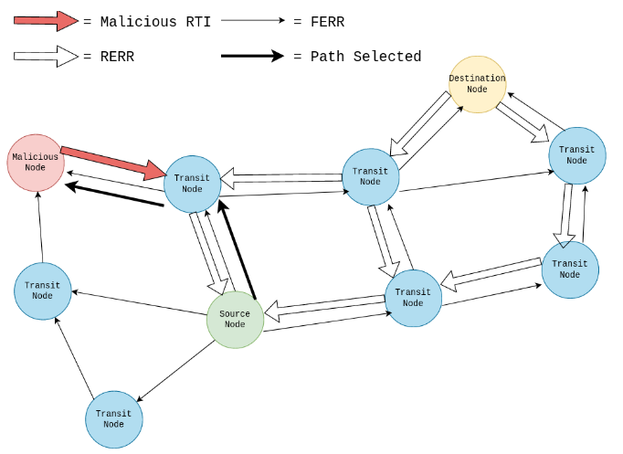

# The Triadically Functional Network Redistribution Protocol

The Triadically Functional Network Redistribution Protocol, TFNr for short, is a revolutionary new blackhole routing protocol devised by yours truly.

This protocol builds off of the current capabilities of MANETs, namely GPSR and AODV (2 of the most prominent). 

This repo contains the basis for a custom network partitioning schema in which networks are segemented in a need-based orientation. As traffic is being dynamically generated and passed through a central entity (in this case it'll be a Qube which I will get to in a second), a custom structural control flow algorithm will be deployed to sporadically analyze this traffic's entry and exit node calls.

The functionality of this is somewhat dependent on the "Tor way of thinking" in the sense that if an entity has corrupted either an entry node or an exit node to a network then they in fact have administrative control over all middle nodes. In this case, TFNr **IS** in fact the node with administrative control over the traffic flow.

----------------

As detailed in the [whitepaper above](./writeup.pdf), all traffic from a source node to a destination node can be tagged as either "forward" or "reverse" in polarity based on the retrospection and request tendencies of the traffic at hand. This traffic, respectively tagged as either *FERR* or *RERR*, is inherently stateless and deformed in nature. This means that for each outbound request is at always fragmented to some extent and never expects a return stream.

For each outbound request to each lowest-cost and least-distance node, the request is passed through a custom hierarchical structured control flow algorithm in which it is mathematically evaluated for string distance (SIFT3) tendencies to be either benign or malicious based off of similarities in a wider area malware signature database. This can be visualized in the diagram below:

When a malicious node is detected, a specific deformed packet query is crafted and pushed to this said malicious node. The biggest change done in a situation like this is that no inbound traffic is expected on the client (application) side. All incoming connection requests or download requests are inherently logged and dropped. After this node is guaranteed to be malicious, a new path through the network is crafted (via MANET routing protocols) in which this malicious node is considered dead. 

While the source node (application or client) continuously looks for the destination node (web server, client) via FERR requests, the destination node simulatenously looks for the source node via RERR requests based on a continuously growing table of pending interests initiation by a client. At some minimal point where the latency of the network is at a low, the source node will be able to successfully securely communicate and exchange information with a benign and legitimate destinaiton node.

This truly allows for a dynamic routing simulation network, in which malicious trafifc is allowed to behave normally all-the while preventing stateful requests and malware to be executed on a live environment, thus preventing unsolicited data leakages and sandbox-escape attacks.
